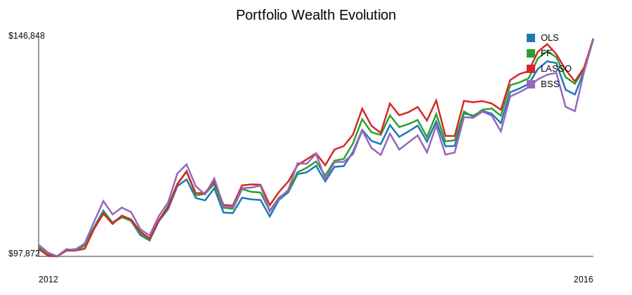
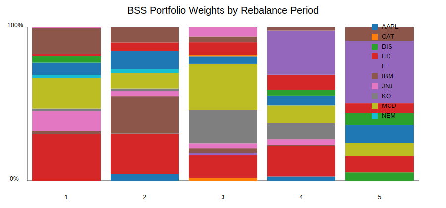

# MMF1921 Project 1: Factor Models and Mean-Variance Optimization

## Introduction

This project compares four linear factor models for a 20-stock U.S. equity universe: ordinary least squares (OLS), Fama-French three-factor regression (FF), least absolute shrinkage and selection operator (LASSO), and Best Subset Selection (BSS). The models estimate monthly expected excess returns and covariance matrices, then those estimates feed a long-only mean-variance optimization strategy from January 2012 through December 2016.

An excess return is an asset return minus the risk-free rate. The project uses excess returns because the factor data includes the monthly risk-free rate, and the factor models are written in excess-return form.

## Data

The stock data contains monthly adjusted close prices for 20 stocks from 31-Dec-2005 to 31-Dec-2016. Monthly stock returns are computed from adjacent adjusted close prices. The factor data contains eight monthly factor returns plus the risk-free rate from 31-Jan-2006 to 31-Dec-2016. After computing returns, the stock-return dates and factor-return dates align exactly.

## Methodology

For each annual rebalance, the calibration window is the immediately preceding four years. For example, the January 2012 portfolio uses data from January 2008 through December 2011. The five out-of-sample test years are 2012, 2013, 2014, 2015, and 2016.

For asset $i$, monthly excess return is

$$
r_i - r_f
$$

where $r_i$ is the monthly stock return and $r_f$ is the monthly risk-free rate.

The OLS model uses all eight factors:

$$
r_i - r_f = \alpha_i + \sum_{k=1}^8 \beta_{ik} f_k + \epsilon_i
$$

where $\alpha_i$ is the intercept, $\beta_{ik}$ is asset $i$'s loading on factor $k$, $f_k$ is factor $k$'s return, and $\epsilon_i$ is the residual.

The FF model uses only market excess return, size, and value. LASSO solves a penalized least-squares problem:

$$
\min_B \|y - X B\|_2^2 + \lambda \|B\|_1
$$

where $y$ is the asset excess-return vector, $X$ is the intercept-plus-factor matrix, $B$ is the coefficient vector, and $\lambda$ is the penalty weight. I used $\lambda = 0.04$, which produced about four selected coefficients on average and therefore matched the assignment's target sparse range.

BSS solves the same least-squares fit subject to at most $K$ non-zero coefficients:

$$
\min_B \|y - X B\|_2^2 \quad \text{subject to} \quad \|B\|_0 \le K
$$

where $\|B\|_0$ counts non-zero coefficients. I used the assignment baseline $K = 4$. Since there are only nine possible coefficients, one intercept plus eight factor loadings, the Python implementation uses exact exhaustive search over all subsets of size at most four.

For each model, the expected excess-return vector $\mu$ is the fitted model's mean prediction over the calibration window. The covariance matrix $Q$ is

$$
Q = B_f^T \Sigma_f B_f + D_\epsilon
$$

where $B_f$ is the factor-loading matrix without the intercept row, $\Sigma_f$ is the factor covariance matrix, and $D_\epsilon$ is the diagonal matrix of residual variances.

The portfolio optimization is long-only mean-variance optimization:

$$
\min_x x^T Q x
$$

subject to

$$
\sum_i x_i = 1, \quad x_i \ge 0, \quad \mu^T x \ge r_{target}
$$

where $x$ is the portfolio-weight vector and $r_{target}$ is the geometric mean of the market factor over the calibration window.

## In-Sample Results

The adjusted $R^2$ statistic measures fit while penalizing models that use more explanatory variables. The table below averages the period-level mean adjusted $R^2$ values across the five calibration windows.

| Model | Mean adjusted R2 | Mean selected coefficients |
| --- | --- | --- |
| OLS | 0.4459 | 9.00 |
| FF | 0.3605 | 4.00 |
| LASSO | 0.2791 | 4.19 |
| BSS | 0.4757 | 4.00 |

Full period-level fit output is saved in `outputs/tables/in_sample_fit_summary.csv`.

## Out-of-Sample Results

| model | average_monthly_return | monthly_volatility | annualized_return | annualized_volatility | sharpe_ratio | final_value |
| --- | --- | --- | --- | --- | --- | --- |
| OLS | 0.006760 | 0.026172 | 0.084199 | 0.090664 | 0.9287 | 146848.16 |
| FF | 0.006745 | 0.026251 | 0.084006 | 0.090937 | 0.9238 | 146695.72 |
| LASSO | 0.006738 | 0.026683 | 0.083921 | 0.092434 | 0.9079 | 146541.65 |
| BSS | 0.005537 | 0.026324 | 0.068511 | 0.091189 | 0.7513 | 136488.86 |

The wealth paths are shown below.



The BSS model's rebalance weights are shown below as a representative sparse-model allocation plot.



## Discussion

OLS has the most flexible unrestricted factor exposure because it uses all eight factors. That can improve in-sample fit, but it also increases the risk that the model fits noise in a four-year monthly window. FF is simpler and easier to interpret, but it can miss effects captured by profitability, investment, momentum, and reversal factors.

LASSO and BSS are sparse approaches. Sparse means many coefficients are forced to zero. This can reduce estimation noise and make factor exposures easier to interpret. The tradeoff is that sparsity can omit useful but weaker factors. BSS is especially direct here because the exhaustive search is exact for this small problem.

The out-of-sample performance table should be read together with the allocation plots. A model with strong final wealth but high concentration may be taking more stock-specific risk. A lower-volatility model may be preferable if the goal is stable wealth rather than only final portfolio value.

## Conclusion

All four factor models can be used to produce the expected returns and covariance matrices required by mean-variance optimization. The experiment shows how estimation choices flow into portfolio construction: unrestricted models can fit more in sample, while sparse models can create cleaner and sometimes more stable out-of-sample allocations. The best model depends on whether the investor values interpretability, diversification, final wealth, or risk-adjusted performance most.

## Reproducibility

Run the project from the `project 1` folder:

```bash
uv run python tests/run_tests.py
uv run python q1_factor_models.py
uv run python q2_portfolio_optimization.py
uv run python q3_results_report.py
```

The scripts use only Python and the data supplied in `source/Python/`.
