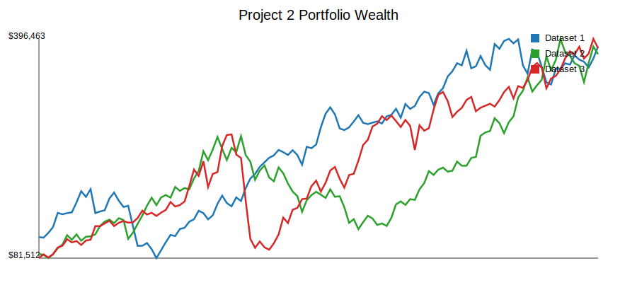
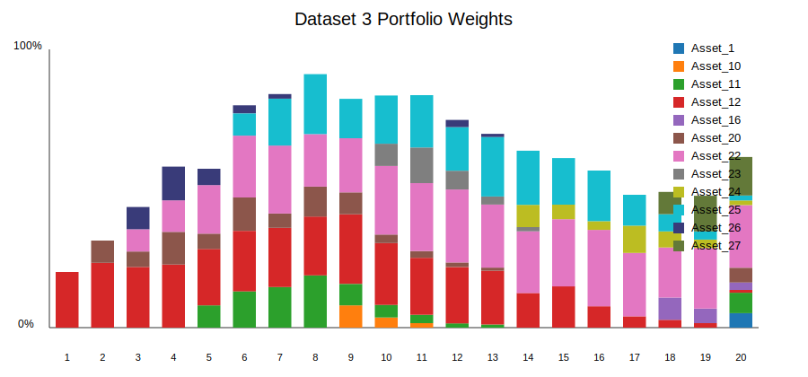

# MMF1921 Project 2: Automated Asset Management Strategy

## Introduction

This report develops a Python-only automated asset management system for the
Project 2 investment competition. The algorithm is designed for monthly equity
and equity-factor data. It uses the first five years of each dataset for
initial calibration and then rebalances every six months.

The assessment criteria are ex-post Sharpe ratio, average turnover, and runtime.
A Sharpe ratio is average excess return divided by volatility, where excess
return means portfolio return minus the risk-free rate. Turnover is the sum of
absolute changes in portfolio weights at a rebalance.

## Methodology

The final strategy is a shrinkage factor-model mean-variance strategy. At each
rebalance date, the algorithm uses the most recent 60 monthly observations. For
asset $i$, the factor model is

$$
r_i - r_f = \alpha_i + \sum_k \beta_{ik} f_k + \epsilon_i
$$

where $r_i$ is the asset return, $r_f$ is the risk-free rate, $\alpha_i$ is the
intercept, $\beta_{ik}$ is the loading of asset $i$ on factor $k$, $f_k$ is
factor $k$, and $\epsilon_i$ is the residual return not explained by the
factors.

The fitted model gives an expected excess-return vector $\mu$ and covariance
matrix $Q$. The covariance estimate is

$$
Q = B^T \Sigma_f B + D_\epsilon
$$

where $B$ is the factor-loading matrix, $\Sigma_f$ is the factor covariance
matrix, and $D_\epsilon$ is the diagonal matrix of residual variances.

Expected returns are noisy, especially with only monthly data, so the raw
factor-model expected returns are shrunk toward their cross-sectional average.
The optimizer solves a long-only mean-variance problem with a maximum single
asset weight:

$$
\min_x \; \frac12 x^T Q x - \gamma \mu^T x
$$

subject to

$$
\sum_i x_i = 1, \quad 0 \le x_i \le 0.20
$$

where $x$ is the portfolio-weight vector and $\gamma$ controls the strength of
the expected-return tilt.

## Turnover Control

Project 2 explicitly grades average turnover, so the final portfolio is blended
with the current pre-trade portfolio after the first rebalance. If $x^*$ is the
new optimized portfolio and $x_0$ is the portfolio after market drift, the
traded portfolio is

$$
x = b x^* + (1-b) x_0
$$

where $b = 0.40$. This reduces unnecessary trading while still allowing the
strategy to adapt to changing factor and risk estimates.

## Training Dataset Results

| Dataset | Sharpe ratio | Average turnover | Annualized excess return | Annualized volatility | Final value |
| --- | --- | --- | --- | --- | --- |
| 1 | 0.1857 | 0.2533 | 11.31% | 16.74% | \$268,023.19 |
| 2 | 0.1615 | 0.2634 | 12.06% | 20.46% | \$375,750.44 |
| 3 | 0.1787 | 0.2802 | 13.67% | 20.82% | \$302,008.10 |

The full output tables are saved in `outputs/tables/`. The wealth and portfolio
composition figures are saved in `outputs/figures/`.

## Discussion

The strategy deliberately avoids aggressive return forecasting. Pure
mean-variance optimization can place extreme weights on assets with slightly
higher estimated returns, but those estimates are unstable in short monthly
samples. Shrinking expected returns and capping single-name weights make the
portfolio less sensitive to estimation error.

The main strength of the algorithm is robustness: it works for different asset
counts, uses only historical information available at each rebalance, and keeps
turnover under control. The main weakness is that conservative shrinkage may
miss strong market regimes where a more aggressive return forecast would have
performed better.

## Conclusion

The selected Project 2 algorithm combines a course-relevant multifactor model
with constrained mean-variance optimization and explicit turnover control. The
implementation is Python-only, uses the provided datasets without modifying
source files, and runs quickly across all three training datasets.

Runtime for the full experiment was 0.50 seconds.
